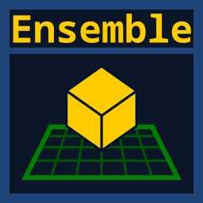

# Ensemble

A multiplayer, collaborative sandbox building game made with Godot 4, C#, .NET, and Avalonia 12. This project is created
and maintained by [**SubParSuperCar**](https://github.com/SubParSuperCar).

> *"Nothing is Arbitrary; Everything is Relative."* 
> <small>- *Ensemble's motto*</small>

 

---

> [!NOTE]
> - **Ensemble** is the direct successor to [**Baja Builders**](https://www.roblox.com/games/85484945236913) on Roblox.
> - Code quality may be "sub-par" (pun intended) as the codebase continues to mature.

> [!WARNING]
> **Ensemble** is in the early stages of development (alpha/pre-release) and should not be considered representative of
future 1.x or later releases. The project has been open-sourced early to encourage feedback, discussion, and
contributions while its architecture, systems, and implementation continue to evolve.

---

## Naming

  
Click to expand/collapse this section.

*(Pronounced "**EN-sem**-bull," not "ON-som-bull.")*

This game was originally called **Baja Builders** on Roblox from approximately 2022-2025. However, the name never really
resonated with me, and "baja" can be interpreted as "below" or "low" in Spanish. I ultimately renamed it to **Ensemble**
for two primary reasons:

1. "Ensemble" literally means a group of people, which reflects the game's multiplayer and collaborative nature.
2. It also sounds like "assemble," making it a fitting name for a building game.

---

## Credits

All `OBJ` files under `/assets/meshes/`, except for `plots_base.obj`, were created by **"Shrimp Fried Koishi."** Other
third-party resources, including NuGet packages and files under `/addons/` and `/Estragonia/`, are distributed under
their respective licenses and are subject to their respective authors' or copyright holders' terms.

---

## License

Ensemble uses separate licenses for its code and non-code assets:

- **Code:** [GNU General Public License v3.0 or later](./LICENSE-CODE.txt)
- **Non-code assets:** [Creative Commons Attribution-NonCommercial-ShareAlike 4.0 International](./LICENSE-ASSETS.txt)

See [**LICENSE.md**](./LICENSE.md) for an overview of the project's licensing.

---

[//]: # (TODO: Media)

## Contributing

Interested in contributing? See [**CONTRIBUTING.md**](./CONTRIBUTING.md) for development setup instructions and
contribution guidelines.
