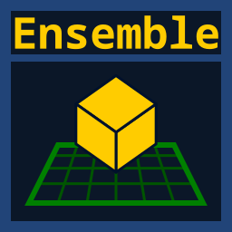
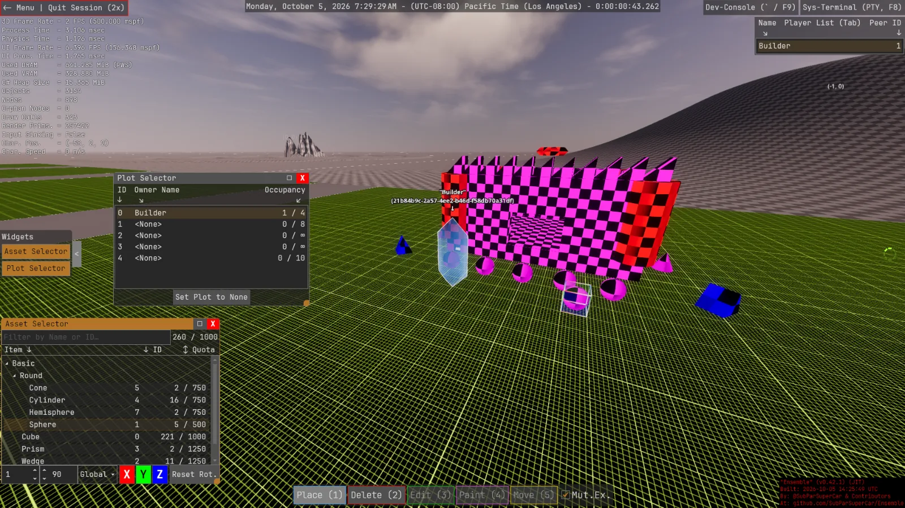
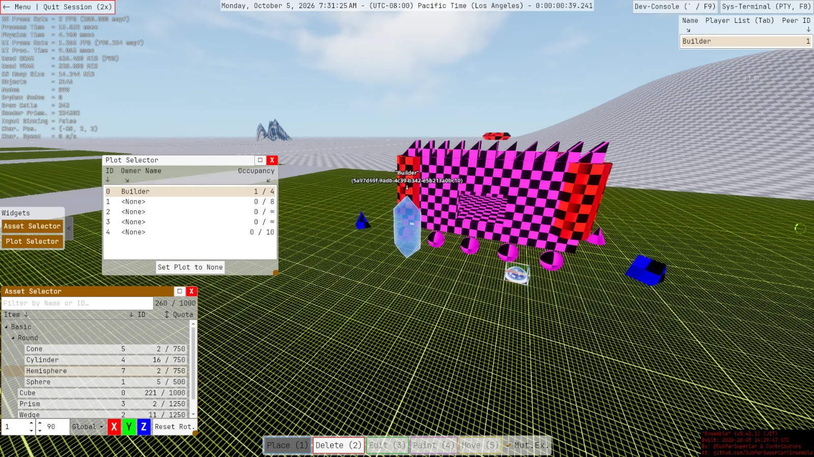
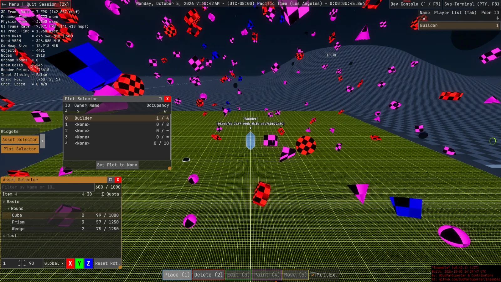
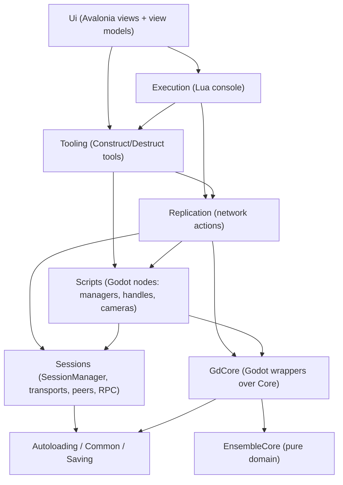
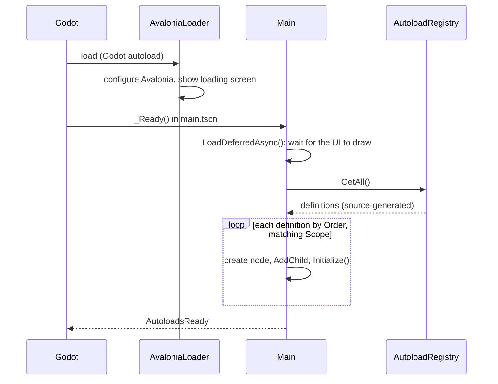
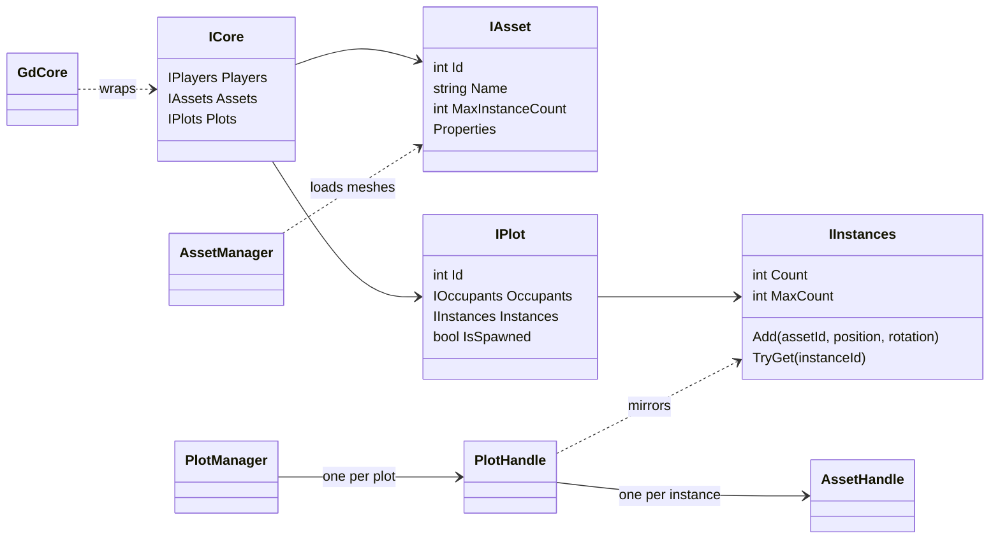
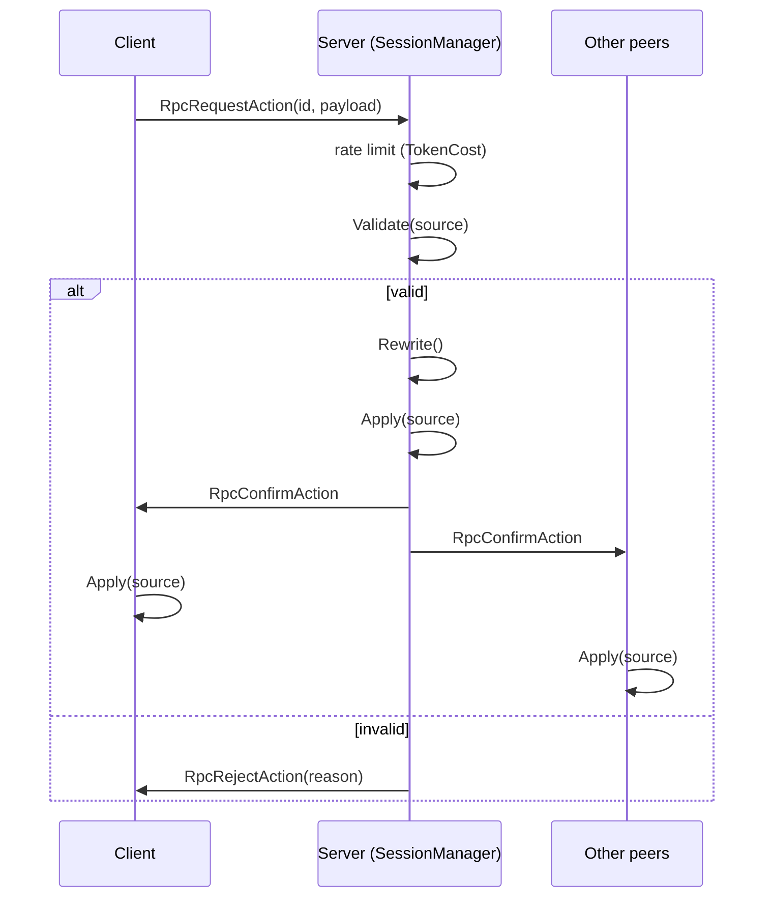
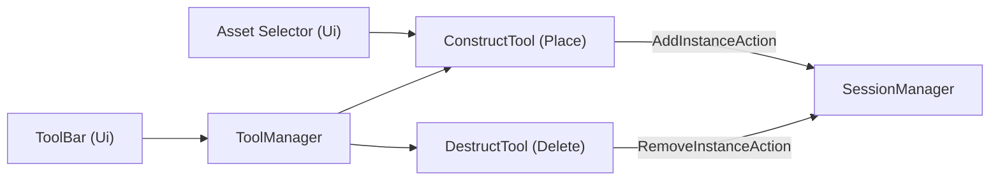

# Ensemble

[](https://github.com/SubParSuperCar/Ensemble/actions/workflows/bin.yml)
[](https://github.com/SubParSuperCar/Ensemble/actions/workflows/src.yml)
[](https://github.com/SubParSuperCar/Ensemble/actions/workflows/cloc.yml)

A multiplayer, collaborative sandbox building game made with Godot 4, C#, .NET, and Avalonia 12. This project is created
and maintained by [**SubParSuperCar**](https://github.com/SubParSuperCar).



> *"Nothing is Arbitrary; Everything is Relative."*<br>
> <small>&mdash; *Ensemble's motto*</small>

<br clear="left"/>

---

> [!NOTE]
> - **Ensemble** is the direct successor to [Baja Builders](https://www.roblox.com/games/85484945236913) on Roblox.
> - Code quality may be "sub-par" (pun intended) as the codebase continues to mature.

> [!WARNING]
> **Ensemble** is in the early stages of development (alpha/pre-release) and should not be considered representative of
> future 1.x or later releases. The project has been open-sourced early to encourage feedback, discussion, and
> contributions while its architecture, systems, and implementation continue to evolve.

---

## Download

> [!NOTE]
> Ensemble has very little gameplay. These builds exist for testing and feedback.

- **Tagged builds:** the [latest release](https://github.com/SubParSuperCar/Ensemble/releases/latest) has self-contained
  Windows, Linux, and macOS builds. Unzip and run `Ensemble.exe` (Windows), `Ensemble.x86_64` (Linux), or
  `Ensemble.app` (macOS) &mdash; no install, no runtime needed.

- **Latest commit:** run the [Build Binaries](https://github.com/SubParSuperCar/Ensemble/actions/workflows/bin.yml)
  workflow ("Run workflow"; on a fork if you lack write access), then download the artifacts from the finished run.

On startup, Ensemble asks GitHub for the latest release and offers each newer version once. If Discord is running,
it also shares your activity (e.g., "In the Main Menu" or "Playing Multi-Player") without names or addresses.

Each platform provides a lean ZIP and a `-debug` ZIP that also includes symbol files. There is also a single `-jit` ZIP
for testing and troubleshooting; see [**Platform Support**](#platform-support) before choosing it.

> [!IMPORTANT]
> macOS builds need one extra step before they'll open &mdash; see [**Bypassing Gatekeeper on
> macOS**](#bypassing-gatekeeper-on-macos) below.

---

## Media

<details open>
  <summary>Click to expand/collapse this section.</summary>

> [!NOTE]
> Some of these screenshots may be out of date or not fully representative of the current state of the gameplay.

Ensemble's placement tool, its preview, and the Plot Selector and Asset Selector widgets:


Ensemble's main menu:


Ensemble's document file viewer showing Ensemble's `README.md` file:


Ensemble's web browser displaying Ensemble's official GitHub repository page:


Ensemble's blocks during the day with the light-mode UI enabled using the `set_ui_dark_theme_on` Lua function:


Ensemble's console, with the output log on the left and the code editor on the right:


Ensemble's blocks at night, generated using the `add_rand_insts` Lua function:


Ensemble's test map:


</details>

---

## Playing Together

<details open>
  <summary>Click to expand/collapse this section.</summary>

Multiplayer is host-authoritative and peer-to-host over UDP (ENet). Everyone must run the **same version**.

- **Host:** *Play &rarr; Multi-Player (Online) &rarr; Host (Server)*. Leave the port empty for the default (`7777`),
  and optionally set a password and a client limit. Share your address with joining players:
    - **Same network (LAN):** run `log_lan_ip4_addr()` in the console (`` ` `` / `F9`).
    - **Over the internet:** keep *Auto Forward Port (UPnP)* checked, and share the join code shown under the player
      list (`Tab`). If your router has UPnP disabled, or is behind another NAT (e.g., CGNAT), forward the UDP port
      manually and share the address from `log_wan_ip4_addr()` instead.
- **Join:** *Play &rarr; Multi-Player (Online) &rarr; Join (Client)*, then enter the host's address (or host name)
  and port, or a single `<address>:<port>` code.
- **Dedicated server:** run the executable headless with user arguments, e.g.,
  `Ensemble.x86_64 --headless -- --port=7777 --password=abc --max-clients=8` (add `--upnp` to forward the port, or
  `--chat-filter=false` to turn off the profanity filter).

Players who join late receive the current state of every plot. Plot changes, placements, and deletions are
synchronized, and characters are replicated. Hosts can list peers (with their ping) using `dmp_peers()` and remove
one using `kick(peer_id, "reason")`. Display names are remembered between sessions.

Chat in the Text Chat widget (it opens in multiplayer; press `/` to type and `Enter` to send). Nametags are colored
per display name, like in Roblox's legacy chat, players joining and leaving are announced, and late joiners receive
the recent history. Hosts filter
profanity by default (masked with `#`, or `<Redacted>` if nothing else remains); dedicated servers take
`--chat-filter=false`. The widget's options can also save each session's chat to `user://chat_logs/`. The console
offers `chat("message")`, `dmp_chat()`, `set_chat_filter_on(false)`, and `set_chat_log_on(true)`.

</details>

---

## Controls

<details>
  <summary>Click to expand/collapse this section.</summary>

| Action                           | Binding                                                  |
|----------------------------------|----------------------------------------------------------|
| Move / run / jump                | `WASD` or `Up` `Down` / `Shift` / `Space` or `Ctrl`      |
| Orbit / turn / zoom camera       | Right mouse / `Q` `E` or `Left` `Right` / wheel, `I` `O` |
| Toggle place / delete tool       | `1` / `2`                                                |
| Place or delete (tool trigger)   | Left mouse                                               |
| Rotate placement (X / Y / Z)     | `R` / `T` / `Y`                                          |
| Reset character position         | Hold `H` for 1 second                                    |
| Player list                      | `Tab`                                                    |
| Chat (with the widget open)      | `/` to type, `Enter` to send, `Esc` to stop typing       |
| Console / system terminal        | `` ` `` or `F9` / `F8`                                   |
| Back (menus)                     | `Backspace`                                              |
| Quick-start a single-player game | `Esc` (outside multiplayer)                              |

The camera also zooms with `-` `=` and `Page Down` `Page Up`, and most actions have gamepad bindings. Run
`dmp_inp_map()` in the console for the full input map.

</details>

---

## Roadmap

Planned systems and their status are tracked in [**ROADMAP.md**](./ROADMAP.md). It is a working checklist, not a
commitment.

---

## Naming

<details open>
  <summary>Click to expand/collapse this section.</summary>

*(Pronounced "**EN-sem**-bull," not "ON-som-bull.")*

This game was originally called **Baja Builders** on Roblox from approximately 2022&ndash;2025. However, the name never
really resonated with me, and "baja" can be interpreted as "below" or "low" in Spanish. I ultimately renamed it to
**Ensemble** for two primary reasons:

1. "Ensemble" literally means a group of people, which reflects the game's multiplayer and collaborative nature.
2. It also sounds like "assemble," making it a fitting name for a building game.

</details>

---

## Platform Support

<details open>
  <summary>Click to expand/collapse this section.</summary>

| Platform | Architecture(s)                | Graphics API                                                    |
|----------|--------------------------------|-----------------------------------------------------------------|
| Windows  | `x86_64`                       | Vulkan                                                          |
| Linux    | `x86_64`                       | Vulkan                                                          |
| macOS    | Universal (`x86_64` + `arm64`) | Metal (native, default), with Vulkan-via-MoltenVK as a fallback |

Ensemble renders through [Godot](https://godotengine.org)'s rendering hardware interface, with an embedded
[Avalonia UI](https://avaloniaui.net) overlay on top of it (via a heavily modified fork of
[Estragonia](https://github.com/MrJul/Estragonia); see [**Credits**](#credits)). Both use Vulkan directly on Windows
and Linux. On macOS, both default to Apple's native Metal API; if you need to fall back to Vulkan (translated
through [MoltenVK](https://github.com/KhronosGroup/MoltenVK)) for troubleshooting, set Godot's
`rendering/rendering_device/driver.macos` project setting to `vulkan`.

Minimum macOS version: **11.0 (Big Sur)** on Intel, **13.0 (Ventura)** on Apple Silicon.

### JIT Build

The regular builds are compiled ahead of time with NativeAOT: fast to start and run, but one download per platform.
The `-jit` ZIP instead runs Ensemble's code on the regular .NET runtime, which compiles it just in time (JIT). It is
slower to start, larger, and **not recommended for playing**, but it bundles both Windows and Linux (`x86_64`) in one
download and keeps every assembly and debug symbol as a separate file, which helps with testing and troubleshooting.
Run `Ensemble.exe` (Windows) or `Ensemble.x86_64` (Linux) from the extracted folder; each uses its own self-contained
.NET runtime in its `data_EnsembleGame_<platform>_x86_64` folder, so keep those folders next to the executables.

### Debug Symbols

NativeAOT stack traces name each method but have no line numbers, so in NativeAOT builds every logged exception is
followed by its `Native frames:` as module offsets (e.g., `EnsembleGame.so+0x7d805b`). The `-debug` ZIPs carry the
matching symbols to turn those into files and lines. Both ZIPs of a version share the same binaries, so offsets logged
by the lean build work too:

- **Linux:** pipe the log through the bundled script, e.g., `./symbolize.sh < log.txt` (needs `addr2line`).
- **Windows:** `llvm-symbolizer --obj=EnsembleGame.dll --relative-address <offset - 1>`, with `EnsembleGame.pdb` beside
  `EnsembleGame.dll`.
- **macOS:** `atos -o EnsembleGame.dylib.dSYM/Contents/Resources/DWARF/EnsembleGame.dylib -l 0 <offset - 1>`.

The `-jit` ZIP needs none of this: its stack traces already include parameter names and line numbers.

### Bypassing Gatekeeper on macOS

> [!NOTE]
> Proper Apple code signing and notarization cost $99/year. Ensemble is free and open-source, so its macOS build is
> only **ad-hoc signed** &mdash; enough for the app to actually run, but not enough for Apple to vouch for it to
> Gatekeeper. This is expected, and isn't a sign that anything is wrong with the build.

Try these in order &mdash; which step you need depends on your macOS version:

1. **Right-click (or Control-click) `Ensemble.app` and choose "Open,"** then click **"Open"** again in the dialog that
   appears. This is usually all it takes.

2. If macOS instead says it **"cannot check it for malicious software"** and doesn't offer an Open button: go to
   **System Settings &rarr; Privacy & Security**, scroll down, and click **"Open Anyway"** next to the mention of
   Ensemble. (You may need to attempt step 1 first for this button to show up.) Confirm once more in the dialog that
   follows.

3. If macOS says `Ensemble.app` **"is damaged and can't be opened"** &mdash; a misleading message Gatekeeper shows for
   unsigned/ad-hoc/non-notarized apps; the download itself isn't actually corrupted &mdash; clear the quarantine flag
   yourself in Terminal:

   ```bash
   xattr -cr /path/to/Ensemble.app
   ```

   Replace the path with wherever you extracted `Ensemble.app`, then try opening it again.

You only need to do this once per downloaded build.

</details>

---

## Architecture

A developer-oriented map of the codebase. Each part below is collapsed by default.

<details>
  <summary><b>Projects and Modules</b></summary>

Ensemble is one Godot C# project (`EnsembleGame.csproj`) plus a few sibling projects listed in `Ensemble.slnx`:

| Project              | Purpose                                                                      |
|----------------------|------------------------------------------------------------------------------|
| `EnsembleGame`       | The game itself: everything below except the other projects in this table.   |
| `EnsembleCore`       | `Core/`: pure C# domain model (assets, instances, plots, players). No Godot. |
| `EnsembleEstragonia` | `Estragonia/`: the Avalonia-in-Godot bridge (forked).                        |
| `AutoloadGenerator`  | Source generator that builds `AutoloadRegistry` from `[Autoload]` classes.   |
| `Tests`              | xUnit v3 tests, run with `dotnet test --solution Ensemble.slnx`.             |

Module layering is enforced at build time by [NsDepCop](https://github.com/realvizu/NsDepCop) (`config.nsdepcop`). The
diagram is simplified: arrows show the main dependencies, and no module may depend on one above it.


```mermaid
graph TD
    Ui["Ui (Avalonia views + view models)"]
    Execution["Execution (Lua console)"]
    Tooling["Tooling (Construct/Destruct tools)"]
    Replication["Replication (network actions)"]
    Scripts["Scripts (Godot nodes: managers, handles, cameras)"]
    Sessions["Sessions (SessionManager, transports, peers, RPC)"]
    GdCore["GdCore (Godot wrappers over Core)"]
    Foundation["Autoloading / Common / Saving"]
    Core["EnsembleCore (pure domain)"]

    Ui --> Execution
    Ui --> Tooling
    Execution --> Tooling
    Execution --> Replication
    Tooling --> Replication
    Tooling --> Scripts
    Replication --> Scripts
    Replication --> Sessions
    Replication --> GdCore
    Scripts --> Sessions
    Scripts --> GdCore
    Sessions --> Foundation
    GdCore --> Core
    GdCore --> Foundation
```

Only `Ui` may reference `Avalonia.*`, `Estragonia.*`, or `EnsembleRoot.Ui.*`. `Globals` is cross-cutting: it exposes
the main singletons (see **Globals** below) and is imported everywhere except the foundation modules.

</details>

<details>
  <summary><b>Boot Sequence</b></summary>

Ensemble does not use Godot's `[autoload]` list for its own systems (only `AvaloniaLoader` is registered there,
alongside the Resonate addon's `SoundManager` and `MusicManager`). Instead, classes marked `[Autoload]` are discovered
at compile time and instantiated by `Main` in `Order`, filtered by `Scope` (`RegularClient` and/or `HeadlessServer`).
Classes implementing `IAutoload` have `Initialize()` called, with failures handled per `AutoloadFailurePolicy`.


```mermaid
sequenceDiagram
    participant G as Godot
    participant AL as AvaloniaLoader
    participant M as Main
    participant R as AutoloadRegistry

    G->>AL: load (Godot autoload)
    AL->>AL: configure Avalonia, show loading screen
    G->>M: _Ready() in main.tscn
    M->>M: LoadDeferredAsync(): wait for the UI to draw
    M->>R: GetAll()
    R-->>M: definitions (source-generated)
    loop each definition by Order, matching Scope
        M->>M: create node, AddChild, Initialize()
    end
    M-->>G: AutoloadsReady
```

| Order          | Autoload           | Scope    | Role                                             |
|----------------|--------------------|----------|--------------------------------------------------|
| `First`        | `Logger`           | all      | Serilog setup and sinks                          |
| `Early`        | `GdCore`           | all      | Owns the Core instance and its Godot wrappers    |
| `Early + 1`    | `SessionManager`   | all      | Single-player / host / join sessions, peers, RPC |
| `Early + 2`    | `PlayerSync`       | all      | Mirrors session peers as GdCore players          |
| `Early + 3`    | `ToolManager`      | client   | Creates and gates tools                          |
| `Standard`     | `ExeHasher`        | all      | Logs the executable's path, size, and hash       |
| `Standard + 1` | `DiscordRpc`       | client   | Discord Rich Presence                            |
| `Standard + 2` | `DiagnosticLogger` | all      | Logs a system report in the background           |
| `Late`         | `WorldManager`     | all      | Instantiates the world scene                     |
| `Late + 1`     | `UpdateChecker`    | client   | Checks GitHub for newer releases                 |
| `Late + 1`     | `HeadlessSession`  | headless | Starts a dedicated server session                |
| `Last`         | `Watchdog`         | all      | Detects main-thread stalls                       |

</details>

<details>
  <summary><b>Data Model: Core, GdCore, and Scripts</b></summary>

State lives in three layers. `Core` holds plain data and rules (counts, limits, ownership). `GdCore` wraps it in
`RefCounted` types so Godot code and the network layer can use it. `Scripts` owns the scene-tree nodes that make it
visible and physical.


```mermaid
classDiagram
    direction LR
    class ICore {
        IPlayers Players
        IAssets Assets
        IPlots Plots
    }
    class IAsset {
        int Id
        string Name
        int MaxInstanceCount
        Properties
    }
    class IPlot {
        int Id
        IOccupants Occupants
        IInstances Instances
        bool IsSpawned
    }
    class IInstances {
        int Count
        int MaxCount
        Add(assetId, position, rotation)
        TryGet(instanceId)
    }
    class GdCore
    class PlotManager
    class PlotHandle
    class AssetManager
    class AssetHandle

    ICore --> IAsset
    ICore --> IPlot
    IPlot --> IInstances
    GdCore ..> ICore : wraps
    PlotManager --> PlotHandle : one per plot
    PlotHandle --> AssetHandle : one per instance
    AssetManager ..> IAsset : loads meshes
    PlotHandle ..> IInstances : mirrors
```

`Sentinels` (`Unlimited = -1`, `None = -1`, `Default = 0`) and `Sentinels.IsLimitReached(count, maxCount)` express
limits throughout.

</details>

<details>
  <summary><b>Networking: Sessions and Actions</b></summary>

Every world change (and chat message) is a network action: a `readonly record struct` implementing
`INetworkAction<TSelf>` with `ToPayload`/`FromPayload`, `Validate`, and `Apply`. Actions self-register in
`NetworkActionRegistry` and are sent with `action.Submit()`. The server is authoritative: it validates, optionally
rewrites (`Rewrite`, e.g., to filter chat), applies, then broadcasts; clients apply only confirmed actions. Remote
requests are rate-limited by a per-action `TokenCost`: each peer has a 100-token bucket that refills in 5 seconds, so
costs read as percentages. Requests beyond it queue for up to another bucket's worth, and are then rejected.


```mermaid
sequenceDiagram
    participant C as Client
    participant S as Server (SessionManager)
    participant O as Other peers

    C->>S: RpcRequestAction(id, payload)
    S->>S: rate limit (TokenCost)
    S->>S: Validate(source)
    alt valid
        S->>S: Rewrite()
        S->>S: Apply(source)
        S->>C: RpcConfirmAction
        S->>O: RpcConfirmAction
        C->>C: Apply(source)
        O->>O: Apply(source)
    else invalid
        S->>C: RpcRejectAction(reason)
    end
```

`SessionManager` drives one `ISession` transport at a time: `EnetSession` (ENet, multi-player, which also owns UPnP
through the optional `IPortMappingSession` capability) or `OfflineSession` (single-player). Other transports can be
plugged in through `SessionManager.StartSession(ISession)`. In single-player, the same path runs locally, with the
player acting as the server.

| Action                  | Effect                                        |
|-------------------------|-----------------------------------------------|
| `SetPlotAction`         | Claims or releases a plot for the sender      |
| `AddInstanceAction`     | Places an asset instance on the sender's plot |
| `RemoveInstanceAction`  | Deletes an instance                           |
| `SetPropertiesAction`   | Changes an instance's properties              |
| `ClearInstancesAction`  | Removes every instance on a plot              |
| `SendChatMessageAction` | Posts a chat message (filtered by the host)   |
| `SetChatFilterAction`   | Toggles the profanity filter (host only)      |

</details>

<details>
  <summary><b>Tools</b></summary>


```mermaid
graph LR
    ToolBar["ToolBar (Ui)"] --> ToolManager
    AssetSelector["Asset Selector (Ui)"] --> Construct
    ToolManager --> Construct["ConstructTool (Place)"]
    ToolManager --> Destruct["DestructTool (Delete)"]
    Construct -->|AddInstanceAction| Net[SessionManager]
    Destruct -->|RemoveInstanceAction| Net
```

`ToolManager` owns every `ToolBase` and, with `UseMutex`, keeps at most one enabled. Tools can only be enabled while
the local plot is editable (not spawned). `ConstructTool` shows a translucent preview with an axial highlight, snaps
edges (not centers) to the plot grid, resolves overlaps with oriented bounding boxes (separating axis theorem), and
supports `RotateX/Y/Z()` and `ResetRotation()` in global or local space.

</details>

<details>
  <summary><b>UI</b></summary>

The UI is an Avalonia app rendered into a Godot `Control` (`Ui`) through Estragonia. It follows MVVM with
CommunityToolkit.Mvvm:

- View models derive from `ViewModelBase` and are created through DI (`services.Create<T>()`).
- Services and view models self-register through marker interfaces (`ITransientObject`, `IScopedObject`,
  `ISingletonObject`); views bind to view models through `IViewFor<TViewModel>` and `ViewLocatorService`.
- `NavigatorService` handles menu navigation (`GoTo<TViewModel>()`, `GoBack()`).
- In-game windows are widgets (`IWidget` + `WidgetDescriptor`), registered automatically and opened and closed by
  `WidgetManagerService`: Plot Selector, Asset Selector, Lua Editor, Log Output, and Web Browser.

</details>

<details>
  <summary><b>Lua Console</b></summary>

The in-game console runs Lua through `LuaExecutor.ExecuteAsync`. Run `help()` in-game for details. Available functions:

| Group       | Functions                                                                                |
|-------------|------------------------------------------------------------------------------------------|
| App         | `quit`, `restart`, `tts`, `wait`                                                         |
| Diagnostics | `clr_log`, `dmp_asm_info`, `dmp_env`, `dmp_inp_map`, `gc`, `help`, `print`               |
| Display     | `cap_fps`, `dmp_vsync_modes`, `set_ui_dark_theme_on`, `set_ui_scale`, `set_vsync_mode`   |
| Session     | `chat`, `dmp_chat`, `dmp_peers`, `kick`, `log_lan_ip4_addr`, `log_wan_ip4_addr`,         |
|             | `set_chat_filter_on`, `set_chat_log_on`                                                  |
| World       | `add_rand_insts`, `clr_insts`, `perf_mod`, `set_static_shader_on`, `set_time`, `tp_char` |

</details>

<details>
  <summary><b>Globals</b></summary>

`Globals/` is imported everywhere through `global using static`, so these are available without qualification:

| Accessor                                          | Returns                                |
|---------------------------------------------------|----------------------------------------|
| `GMain`                                           | The `Main` node                        |
| `GCore`, `GAssets`, `GPlots`, `GPlayers`          | `GdCore` and its wrappers              |
| `GSessionManager`                                 | The `SessionManager` autoload          |
| `GChatManager`                                    | The `ChatManager` autoload             |
| `GPlotManager`, `GAssetManager`, `GPlayerManager` | Scene managers in `Scripts`            |
| `GToolManager`                                    | The `ToolManager` autoload             |
| `GTimeProvider`                                   | Wrapped `TimeProvider` (testable time) |

`GContext` exposes local-player state such as `LocalPlot` and `IsLocalPlotSpawned`. `Constants` (e.g.,
`AnimationDuration` and `GameVersion`) and Core's `Sentinels` are imported the same way.

</details>

---

## Credits

All `OBJ` files under `/assets/meshes/`, except for `plots_base.obj`, were created by **"Shrimp Fried Koishi."** Other
third-party resources, including NuGet packages and files under `/addons/` and `/Estragonia/`, are distributed under
their respective licenses and are subject to their respective authors' or copyright holders' terms. The chat's
profanity filter uses David Sojevic's [profanity-list](https://github.com/dsojevic/profanity-list) (MIT; see
`/Common/Text/ProfanityList.LICENSE.txt`), with `allow_partial` set on entries that misfire inside ordinary words. It's
stored encoded, so its terms aren't readable in the source; see `/.github/scripts/profanity-list.sh`. Chat nametag
colors use the algorithm from Baja Builders, Ensemble's Roblox predecessor.

---

## License

Ensemble uses separate licenses for its code and non-code assets:

- **Code:** [**GNU General Public License v3.0 or later**](./LICENSE-CODE.txt)
- **Non-code assets:**
  [**Creative Commons Attribution-NonCommercial-ShareAlike 4.0 International**](./LICENSE-ASSETS.txt)

See [**LICENSE.md**](../LICENSE.md) for an overview of the project's licensing.

---

## Contributing

Interested in contributing? See [**CONTRIBUTING.md**](./CONTRIBUTING.md) for development setup instructions and
contribution guidelines.
